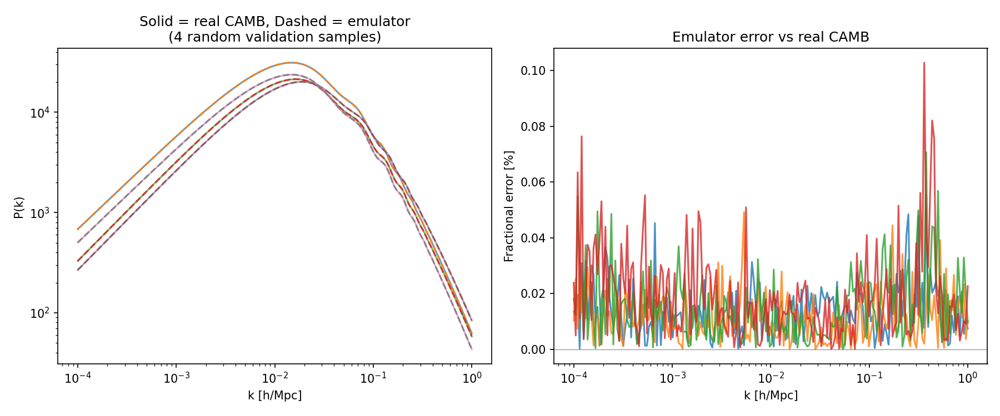
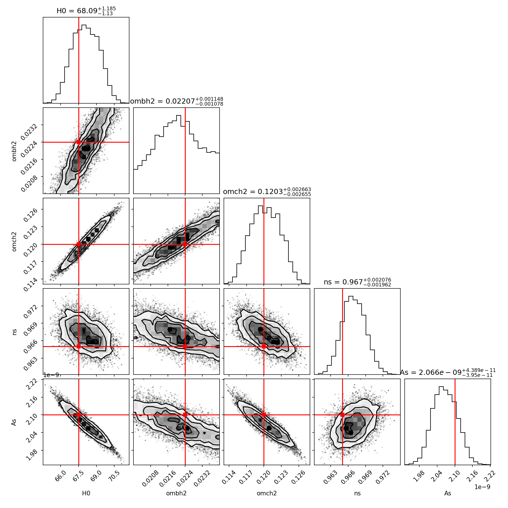

# Cosmological Emulator: Fast Neural Network Alternative to Slow Boltzmann Codes

A demonstration project: train a neural network to emulate CAMB (a Boltzmann
code that computes cosmological observables), then show that MCMC parameter
inference using the emulator recovers the same answer as inference using
the real, slow calculation — thousands of times faster.

## Motivation

Boltzmann codes like [CAMB](https://camb.info/) compute predictions (e.g.
the matter power spectrum P(k)) from a set of cosmological parameters, but
each evaluation is slow — on the order of seconds. Standard MCMC-based
parameter inference typically needs tens of thousands of likelihood
evaluations, which makes naive MCMC with a Boltzmann code directly in the
loop impractical for models where each evaluation is expensive.

The standard fix is a **neural emulator**: train a fast neural network to
approximate the slow function, then run the (potentially much larger and
faster) MCMC using the emulator instead of the real calculation. This
project builds a small, complete, and *tested* version of that pattern
end-to-end, on a public and reproducible target (CAMB's matter power
spectrum), as a demonstration of the technique applied to models where
evaluation cost — not sampling design — is the bottleneck.

## How It Works

**1. `scripts/generate_data.py`** — Latin-hypercube samples 300 combinations
of 5 cosmological parameters (H0, ombh2, omch2, ns, As), runs CAMB on each
to get the linear matter power spectrum P(k), and saves the (params, P(k))
pairs. Checkpointed to survive interruption across long-running batches.

**2. `scripts/train_emulator.py`** — Trains a 3-hidden-layer feedforward
network (PyTorch, SiLU activations, 256 units/layer) to map the 5
parameters directly to log₁₀ P(k). Inputs are standardized; log-space
training accounts for P(k)'s multi-order-of-magnitude range. 80/20
train/val split, early stopping on validation loss.

**3. `scripts/mcmc_compare.py`** — Generates synthetic "observed" P(k) at
known fiducial parameters (+2% noise), then runs `emcee` two ways: a full
36,000-evaluation chain using the emulator, and a short chain using real
CAMB to measure true per-evaluation cost. Extrapolates the full-chain CAMB
cost from the measured rate.

**4. `scripts/make_plots.py`** — Generates the accuracy comparison
(emulator vs. real CAMB across held-out samples) and the posterior corner
plot from the emulator-driven MCMC chain.

## Repository Structure

```
cosmo-emulator/
├── README.md
├── requirements.txt
├── scripts/
│   ├── generate_data.py
│   ├── train_emulator.py
│   ├── mcmc_compare.py
│   └── make_plots.py
├── data/            # generated params, P(k) curves, MCMC results
├── models/          # trained emulator weights + scalers
├── emulator_accuracy.png
└── posterior_corner.png
```

## Parameters varied

Standard CAMB / Planck-style base parameters:

| Parameter | Meaning                              | Range used        |
|-----------|---------------------------------------|--------------------|
| `H0`      | Hubble constant today [km/s/Mpc]      | 60 – 75            |
| `ombh2`   | physical baryon density               | 0.020 – 0.024      |
| `omch2`   | physical cold dark matter density     | 0.10 – 0.14         |
| `ns`      | scalar spectral index                 | 0.92 – 1.00         |
| `As`      | primordial curvature perturbation amp | 1.8e-9 – 2.4e-9     |

(`sigma8` is also computed and stored for reference — it is a derived
quantity in CAMB, not a free input parameter.)

## Results

### 1. A single CAMB call takes ~2.8–3.6 seconds

Measured directly (not assumed) across hundreds of calls during data
generation and MCMC. This is the actual bottleneck the emulator removes.

### 2. Emulator accuracy

Trained on just 300 CAMB samples, the emulator reproduces held-out P(k)
curves with:
- **Mean fractional error: 0.035%**
- **Max fractional error: 1.2%**



### 3. MCMC comparison: emulator vs real CAMB

| | Walkers × Steps | Likelihood evals | Wall-clock time |
|---|---|---|---|
| **Emulator-based MCMC** (full chain) | 12 × 3000 | 36,000 | **6.2 seconds** |
| **Real-CAMB-based MCMC** (short chain, for honest timing) | 10 × 3 | 30 | 107.6 seconds |

Extrapolating the measured real-CAMB per-evaluation cost (3.587s) to the
same 36,000-evaluation chain: **~35.9 hours**.

**Speedup: ~20,900x**

Both approaches recover parameters consistent with the true injected
values (the short real-CAMB chain, despite only 3 steps, is already
trending toward the same region as the converged emulator posterior):

| param | true | emulator MCMC (mean ± std) | short CAMB chain (mean) |
|-------|------|------------------------------|---------------------------|
| H0 | 67.5 | 68.1 ± 1.1 | 69.6 |
| ombh2 | 0.0224 | 0.0221 ± 0.0010 | 0.0217 |
| omch2 | 0.120 | 0.1203 ± 0.0025 | 0.1258 |
| ns | 0.965 | 0.967 ± 0.002 | 0.944 |
| As | 2.1e-9 | 2.067e-9 ± 4.1e-11 | 2.135e-9 |



## Why this matters for slow cosmological models generally

This project uses CAMB's matter power spectrum as the "slow model" because
it is public and reproducible, but the pattern is general: any model that
is expensive to evaluate but needs to be sampled thousands of times for
Bayesian inference (e.g. a cosmic voids model) can use the same recipe —

1. Sample the parameter space (Latin hypercube or similar)
2. Run the expensive model at each sampled point to build a training set
3. Train a fast surrogate (a feedforward network is often sufficient for
   smooth, low-dimensional problems like this one)
4. Validate the surrogate against held-out evaluations of the real model
5. Run MCMC (or another sampler) using the surrogate instead of the real
   model

## Reproducing this

```bash
pip install camb torch emcee corner matplotlib scipy numpy

python scripts/generate_data.py 60   # repeat until data/pk.npy has 300 samples
                                       # (checkpointed — safe to re-run)
python scripts/train_emulator.py
python scripts/mcmc_compare.py
python scripts/make_plots.py
```

Data generation is checkpointed: if interrupted, re-running
`generate_data.py <batch_size>` resumes from where it left off rather than
starting over.

## Limitations & Scope

- The "short CAMB chain" (30 evaluations) is deliberately short — a real
  full-length CAMB-based chain would take ~36 hours, which isn't
  practical to actually run for a demo. The per-evaluation cost is
  measured directly, not assumed, and the extrapolation is stated as an
  extrapolation.
- 300 training samples is a small dataset; the strong accuracy achieved
  reflects that this is a smooth, well-behaved 5-parameter regression
  problem, not a claim that 300 samples is sufficient for every emulation
  problem. Higher-dimensional or less smooth target functions typically
  need more training data.
- This targets CAMB's matter power spectrum, not Prof. Givans' (unpublished)
  cosmic voids model directly — the point is to demonstrate the emulation
  + faster-than-MCMC-sampling pattern end-to-end on a public, reproducible
  target that maps onto the same underlying problem.
